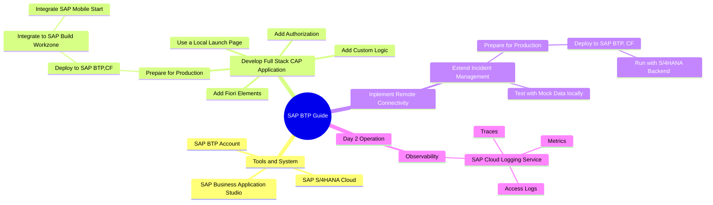
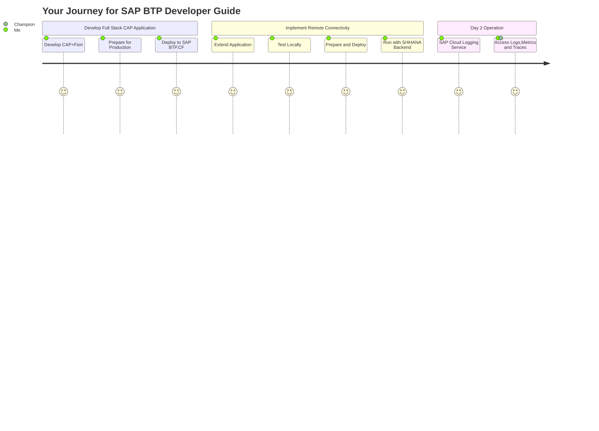

# Clean Core Full Stack Application Development with SAP BTP

## MindMap

## Understand Your Journey

## Develop and Deploy Full-Stack CAP Application

1. [Set Up SAP Business Application Studio](https://developers.sap.com/tutorials/set-up-bas.html)
2. [Build a CAP Application](https://developers.sap.com/tutorials/build-cap-app.html)
3. [Add SAP Fiori Elements UIs](https://developers.sap.com/tutorials/add-fiori-elements-uis.html)
4. [Add Custom Logic](https://developers.sap.com/tutorials/add-custom-logic.html)
5. [Use a Local Launch Page](https://developers.sap.com/tutorials/use-local-launch-page.html)
6. [Add Authorization](https://developers.sap.com/tutorials/add-authorization.html)
7. [Add Test Cases](https://developers.sap.com/tutorials/add-test-cases.html)
8. [Prepare for Production](https://developers.sap.com/tutorials/prep-for-prod.html)
9. [Prepare for Deployment in the SAP BTP, Cloud Foundry Runtime](https://developers.sap.com/tutorials/prepare-btp-cf.html)
10. [Deploy in SAP BTP, Cloud Foundry Runtime](https://developers.sap.com/tutorials/deploy-to-cf.html)
11. [Assign the User Roles](https://developers.sap.com/tutorials/user-role-assignment.html)
12. [Integrate Your Application with SAP Build Work Zone, Standard Edition](https://developers.sap.com/tutorials/integrate-with-work-zone.html)

