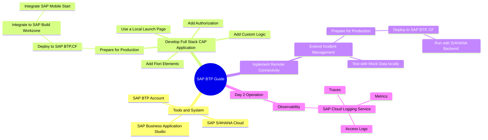
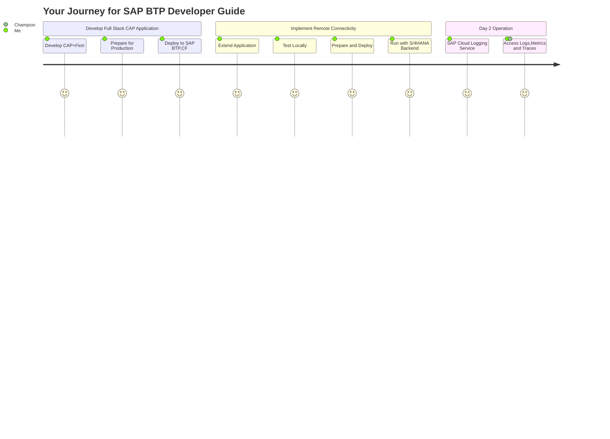

# Clean Core Full Stack Application Development with SAP BTP

## MindMap

```mermaid
   mindmap
  root((SAP BTP Guide))
    Tools and System
      SAP Business Application Studio
      SAP S/4HANA Cloud
      SAP BTP Account
    Develop Full Stack CAP Application 
      Add Custom Logic
      Add Fiori Elements
      Use a Local Launch Page
      Add Authorization
      Prepare for Production
        Deploy to SAP BTP,CF
          Integrate to SAP Build Workzone
            Integrate SAP Mobile Start
    Inplement Remote Connectivity
      Extend Incident Management
        Test with Mock Data locally
        Prepare for Production
          Deploy to SAP BTP, CF
            Run with S/4HANA Backend 
    Day 2 Operation
      Observability
        SAP Cloud Logging Service
          Access Logs
          Metrics
          Traces


```
## Understand Your Journey

```mermaid
journey
    title Your Journey for SAP BTP Developer Guide
    section Develop Full Stack CAP Application
      Develop CAP+Fiori: 5: Me
      Prepare for Production: 5: Me
      Deploy to SAP BTP,CF: 5: Me
    section Implement Remote Connectivity
      Extend Application: 5: Me
      Test Locally: 5: Me
      Prepare and Deploy: 5: Me
      Run with S/4HANA Backend: 5: Me 
    section Day 2 Operation
      SAP Cloud Logging Service: 5: Me
      Access Logs,Metrics and Traces: 5: Me,Champion
```

